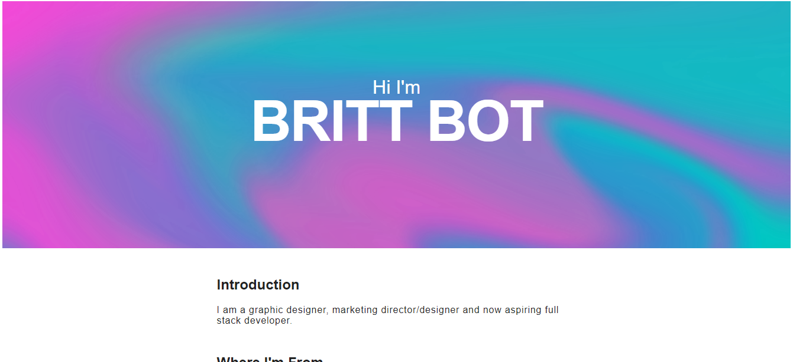
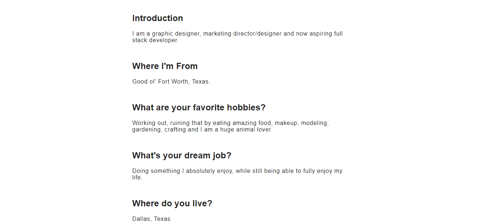
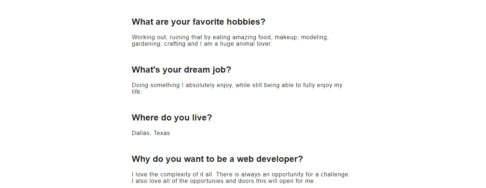

# Prework-Portfolio

## Description 

This page is one of my first "projects". It is one of the Prework Assignments during the bootcamp course.

The project was to create a page with your current knowledge for your portfolio. 

**DISCLAIMER** Trust the process! 🤪😅🤩🥳

[MOST CURRENT VERSION OF PORTFOLIO (as of 04/05/2021) Repo](https://github.com/britt-bot/08-Updated_Portfolio)

[MOST CURRENT VERSION OF PORTFOLIO (as of 04/05/2021) Deployed](https://britt-bot.github.io/08-Updated_Portfolio/)

## Table of Contents (Optional)

If your README is very long, add a table of contents to make it easy for users to find what they need.

* [Installation](#installation)
* [Usage](#usage)
* [Credits](#credits)
* [License](#license)

## Installation

Open the desired web browser and go to the page url for either the Repo or the Deployed project.

[Prework - Portfolio Repo](https://github.com/britt-bot/Prework-Portfolio)

[Prework - Portfolio Deploy](https://britt-bot.github.io/Prework-Portfolio/)

## Usage 

Provide instructions and examples for use. Include screenshots as needed. 

To add a screenshot:

## Credits

Forked from: 
[Coding-Boot-Camp](https://github.com/coding-boot-camp/prework-about-me)

## License

MIT License

Copyright (c) 2021 Britt Bot

Permission is hereby granted, free of charge, to any person obtaining a copy
of this software and associated documentation files (the "Software"), to deal
in the Software without restriction, including without limitation the rights
to use, copy, modify, merge, publish, distribute, sublicense, and/or sell
copies of the Software, and to permit persons to whom the Software is
furnished to do so, subject to the following conditions:

The above copyright notice and this permission notice shall be included in all
copies or substantial portions of the Software.

THE SOFTWARE IS PROVIDED "AS IS", WITHOUT WARRANTY OF ANY KIND, EXPRESS OR
IMPLIED, INCLUDING BUT NOT LIMITED TO THE WARRANTIES OF MERCHANTABILITY,
FITNESS FOR A PARTICULAR PURPOSE AND NONINFRINGEMENT. IN NO EVENT SHALL THE
AUTHORS OR COPYRIGHT HOLDERS BE LIABLE FOR ANY CLAIM, DAMAGES OR OTHER
LIABILITY, WHETHER IN AN ACTION OF CONTRACT, TORT OR OTHERWISE, ARISING FROM,
OUT OF OR IN CONNECTION WITH THE SOFTWARE OR THE USE OR OTHER DEALINGS IN THE
SOFTWARE.